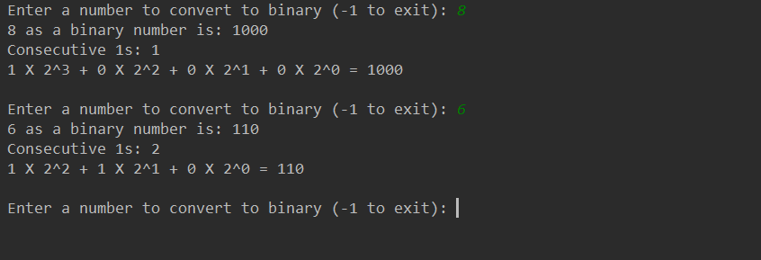

# Binary Number Converter in Java

This app converts a given integer to its binary representation! It even works for very large binary strings 
because the digits are stored in a list data structure. 
You can also see the binary number expression to help understand how they work as base 2 numbers. 

Sample output:

